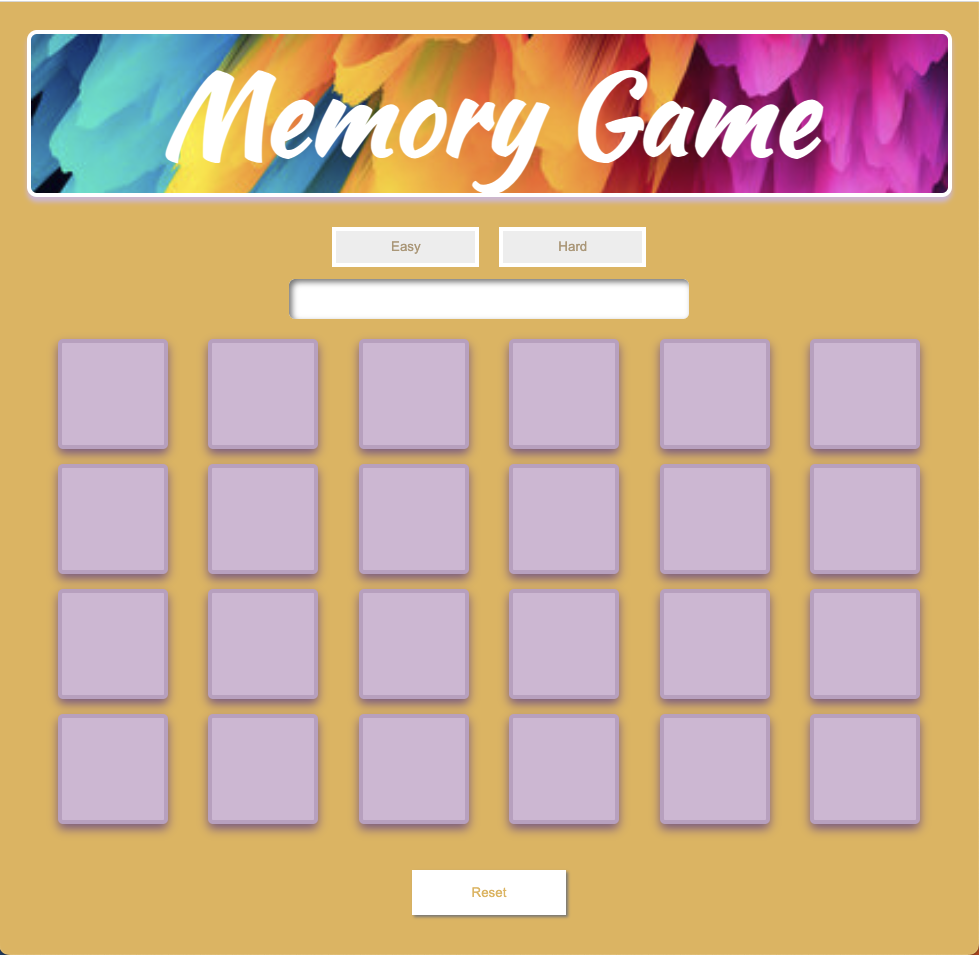

[Memory-Game](https://memorygamebylindsay.surge.sh/)
Create a memory game using a joke API

Deployed Game:
https://memorygamebylindsay.surge.sh/

How it works:
The gameboard consists of 24 cards
The deck of 24 cards begins image-side down.
-  Choose between easy and hard mode by clicking the associated button. The game is set to default to easy mode.
- Click two cards that you think will match to "flip them over" and show the images.
- If they match, the cards will stay flipped over.
- If they do not match they revert to image-side down and you repeat, clicking the cards with no images unitl all cards have been matched.
- The game ends when all cards are matched or the timer runs out.
- Win the game, and claim your prize at the end(hint: your prize is a joke)

Languages used:
- HTML
- CSS
- Javascript

Future game features:
- "Hard" mode update, including: the addition of a 25th card to the deck as a joker card that, when clicked on will remove 20s econds from the timer.
- Audio for every card click
- A hint option for easy mode. After you click the first card, if you wait longer than 5 seconds before choosing the partner card it will wiggle(move up by 2px repeatedly).

###Credits:
- https://github.com/15Dkatz/official_joke_api
- https://developer.mozilla.org/en-US/docs/Web/CSS/CSS_media_queries/Using_media_queries
- https://www.youtube.com/watch?v=M0egyNvsN-Y&t=424s
- https://www.youtube.com/watch?v=UDIfuvLEkjU&t=667s

